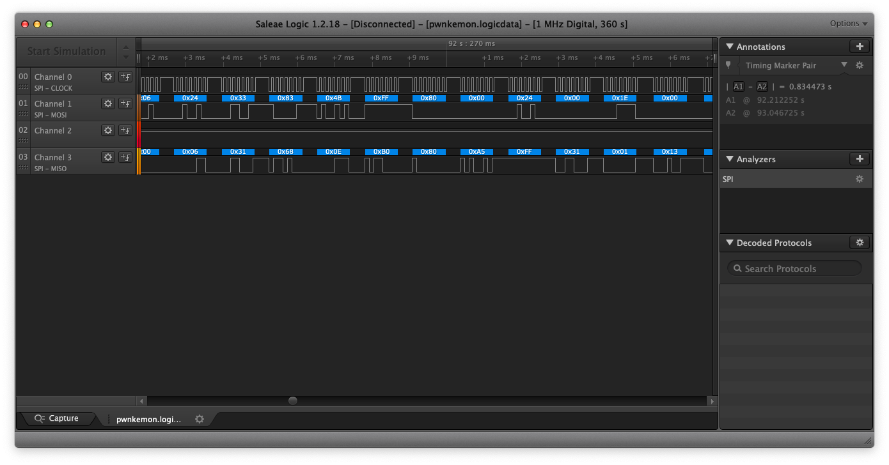

# PWNkemon

### Challenge Text

> The picture should explain everything.
> Careful, flag format is in a different format: `CSCG(...)`

### Challenge Work

First, lets unzip the challenge packet:

```bash
/tmp % unzip pwnkemon.zip
Archive:  pwnkemon.zip
  inflating: pwnkemon.jpg
  inflating: pwnkemon.logicdata
```

Second, lets look at the picture - 


We see a logic analyzer attached to a GameBoy Link cable. We can see that the guide behind the Gameboys says Pokémon. We can probably assume we will be looking at a logic capture of a Pokémon trade.

We open the `.logicdata` file in the free demo of Saleae and we can confirm that it is a capture of four digital channels. We can also determine, from Google, that the Gameboy Link Cable uses SPI as a protocol. Saleae has a built in SPI decoder. After messsing with the settings we got some hexadecimal information to display.

Here is the SPI settings we used:


We then went into Saleae and set a marker around where the file opened up naturally (around 92ms). We then enabled the SPI alayzer and then we saw things like this:



After this we exported the two channels to a CSV, keeping only the hexadecimal values. (See `spi.csv`)

We noticed these bytes did not decode into anything legible. At first we were stumped, then I had the thought to Google if the generation one Pokémon games used their own special encoding. It turns out they do. (You can read more [here](https://bulbapedia.bulbagarden.net/wiki/Character_encoding_in_Generation_I) if you are interested.)


For each byte that we get from the capture we take the first character and select that corresponding row, then we take the second character and select that corresponding column.

I took this chart and made it into a CSV of its own, replacing all of the `NULL` ,`Junk`, `Control`, or `Text box` characters with `*` . (See `gen_chars.csv`)

I then wrote a script to display the generated translations. I tried the MOSI first, but that was not right. Then I tried the MISO and that gave us our flag.

```python
import pandas as pd

chars_df = pd.read_csv("./gen_chars.csv")
spi_df = pd.read_csv("./spi.csv")

bytes_map = {
    "0": 0,
    "1": 1,
    "2": 2,
    "3": 3,
    "4": 4,
    "5": 5,
    "6": 6,
    "7": 7,
    "8": 8,
    "9": 9,
    "A": 10,
    "B": 11,
    "C": 12,
    "D": 13,
    "E": 14,
    "F": 15
}

def get_gen_char(byte_string):
    byte_one = byte_string[2]
    byte_two = byte_string[3]
    
    char_row = bytes_map[byte_one]
    
    return chars_df.iloc[char_row][byte_two].strip()
    
mosi_list = spi_df.MOSI.tolist()
miso_list = spi_df.MISO.tolist()

try_word = []

for char in miso_list:
    try:
        try_word.append(get_gen_char(char))
    except:
        pass
    
print("".join(try_word))
```

```
[..........]
CSCG(GONNA*-hack-em-A*ll-PWNkemo*n!!!)
[..........]
```

I removed the `*`'s from the string for the final true flag of: `CSCG(GONNA-hack-em-All-PWNkemon!!!)`

