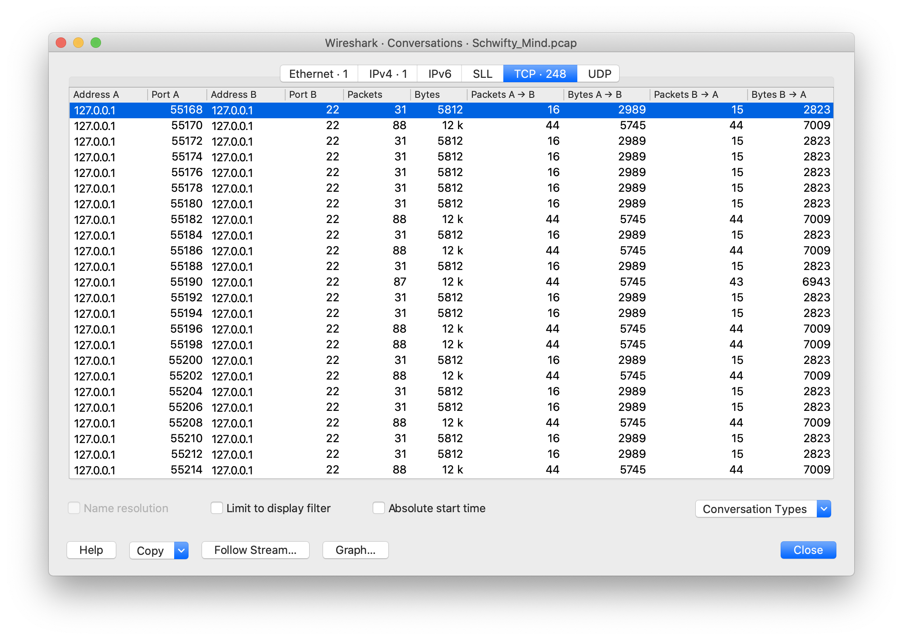

# Schwifty Mind!


### Challenge Text
> Let's send a message to aliens 🛸❤️😊
>
>Peace among worlds!

### Challenge Work

When we look at the PCAP we can see that there are a ton of SSH connections being made on 127.0.0.1. If you look at all of the conversation in Wireshark...



We can see that the length of total Packets from A -> B for each conversation seems to only be of two values....binary?


```python
import pandas as pd
df = pd.read_csv("pcap.csv")
```


```python
df.sample(10)
```


<div>
<style scoped>
    .dataframe tbody tr th:only-of-type {
        vertical-align: middle;
    }

    .dataframe tbody tr th {
        vertical-align: top;
    }

    .dataframe thead th {
        text-align: right;
    }
</style>
<table border="1" class="dataframe">
  <thead>
    <tr style="text-align: right;">
      <th></th>
      <th>Address A</th>
      <th>Port A</th>
      <th>Address B</th>
      <th>Port B</th>
      <th>Packets</th>
      <th>Bytes</th>
      <th>Packets A → B</th>
      <th>Bytes A → B</th>
      <th>Packets B → A</th>
      <th>Bytes B → A</th>
      <th>Rel Start</th>
      <th>Duration</th>
      <th>Bits/s A → B</th>
      <th>Bits/s B → A</th>
    </tr>
  </thead>
  <tbody>
    <tr>
      <th>8</th>
      <td>127.0.0.1</td>
      <td>55184</td>
      <td>127.0.0.1</td>
      <td>22</td>
      <td>31</td>
      <td>5812</td>
      <td>16</td>
      <td>2989</td>
      <td>15</td>
      <td>2823</td>
      <td>22.056548</td>
      <td>2.839201</td>
      <td>8422.087763</td>
      <td>7954.350537</td>
    </tr>
    <tr>
      <th>159</th>
      <td>127.0.0.1</td>
      <td>55486</td>
      <td>127.0.0.1</td>
      <td>22</td>
      <td>88</td>
      <td>12754</td>
      <td>44</td>
      <td>5745</td>
      <td>44</td>
      <td>7009</td>
      <td>377.657531</td>
      <td>1.445183</td>
      <td>31802.200829</td>
      <td>38799.238574</td>
    </tr>
    <tr>
      <th>233</th>
      <td>127.0.0.1</td>
      <td>55634</td>
      <td>127.0.0.1</td>
      <td>22</td>
      <td>31</td>
      <td>5812</td>
      <td>16</td>
      <td>2989</td>
      <td>15</td>
      <td>2823</td>
      <td>542.828634</td>
      <td>2.863389</td>
      <td>8350.943585</td>
      <td>7887.157491</td>
    </tr>
    <tr>
      <th>228</th>
      <td>127.0.0.1</td>
      <td>55624</td>
      <td>127.0.0.1</td>
      <td>22</td>
      <td>85</td>
      <td>12520</td>
      <td>42</td>
      <td>5613</td>
      <td>43</td>
      <td>6907</td>
      <td>532.919449</td>
      <td>1.413712</td>
      <td>31763.187976</td>
      <td>39085.754383</td>
    </tr>
    <tr>
      <th>121</th>
      <td>127.0.0.1</td>
      <td>55410</td>
      <td>127.0.0.1</td>
      <td>22</td>
      <td>70</td>
      <td>11142</td>
      <td>38</td>
      <td>5349</td>
      <td>32</td>
      <td>5793</td>
      <td>287.111959</td>
      <td>1.416543</td>
      <td>30208.754694</td>
      <td>32716.267702</td>
    </tr>
    <tr>
      <th>3</th>
      <td>127.0.0.1</td>
      <td>55174</td>
      <td>127.0.0.1</td>
      <td>22</td>
      <td>31</td>
      <td>5812</td>
      <td>16</td>
      <td>2989</td>
      <td>15</td>
      <td>2823</td>
      <td>7.412830</td>
      <td>2.917926</td>
      <td>8194.861693</td>
      <td>7739.743914</td>
    </tr>
    <tr>
      <th>31</th>
      <td>127.0.0.1</td>
      <td>55230</td>
      <td>127.0.0.1</td>
      <td>22</td>
      <td>88</td>
      <td>12754</td>
      <td>44</td>
      <td>5745</td>
      <td>44</td>
      <td>7009</td>
      <td>73.005579</td>
      <td>1.423857</td>
      <td>32278.522352</td>
      <td>39380.359123</td>
    </tr>
    <tr>
      <th>64</th>
      <td>127.0.0.1</td>
      <td>55296</td>
      <td>127.0.0.1</td>
      <td>22</td>
      <td>31</td>
      <td>5812</td>
      <td>16</td>
      <td>2989</td>
      <td>15</td>
      <td>2823</td>
      <td>154.522120</td>
      <td>3.889993</td>
      <td>6147.054763</td>
      <td>5805.665974</td>
    </tr>
    <tr>
      <th>109</th>
      <td>127.0.0.1</td>
      <td>55386</td>
      <td>127.0.0.1</td>
      <td>22</td>
      <td>88</td>
      <td>12754</td>
      <td>44</td>
      <td>5745</td>
      <td>44</td>
      <td>7009</td>
      <td>260.286775</td>
      <td>1.440183</td>
      <td>31912.611106</td>
      <td>38933.941034</td>
    </tr>
    <tr>
      <th>236</th>
      <td>127.0.0.1</td>
      <td>55640</td>
      <td>127.0.0.1</td>
      <td>22</td>
      <td>31</td>
      <td>5812</td>
      <td>16</td>
      <td>2989</td>
      <td>15</td>
      <td>2823</td>
      <td>551.258872</td>
      <td>3.451509</td>
      <td>6927.984253</td>
      <td>6543.225007</td>
    </tr>
  </tbody>
</table>
</div>


```python
bin_valuesA = df["Packets A → B"].values

bin_string1 = ""
bin_string2 = ""

# Lets try both options at once here to save time
for i in bin_valuesA:
    if i > 40:
        bin_string1 += "0"
        bin_string2 += "1"
    if i < 40:
        bin_string1 += "1"
        bin_string2 += "0"
```


```python
def splitbinstring(bin_string):
    chunks, chunk_size = len(bin_string), len(bin_string)//28
    return [ bin_string[i:i+chunk_size] for i in range(0, chunks, chunk_size) ]

# Thanks! https://stackoverflow.com/questions/7396849/convert-binary-to-ascii-and-vice-versa
def bitstostring(b=None):
    str_array = []
    for x in b:
        str_array.append(chr(int(x, 2)))
    return "".join(str_array)
```


```python
for target in [bin_string1, bin_string2]:
    print(bitstostring(splitbinstring(target)))
```

    ¾¬¶¬„“Ì‹Ê ˜Ì‹ ¬Ü—‰‰Î™È† Ë˜žÎ±Þ‚
    ASIS{l3t5_g3t_S#hvv1f7y_4ga1N!}

